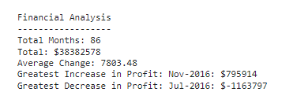

# Console-Finances
Challenge-4

In this exercise I am creating a financial analysis from a supplied values...
the code take the supplied values and crate a table with different part like I show you in the next screenshot

I used a javascript code to create this analysis.

